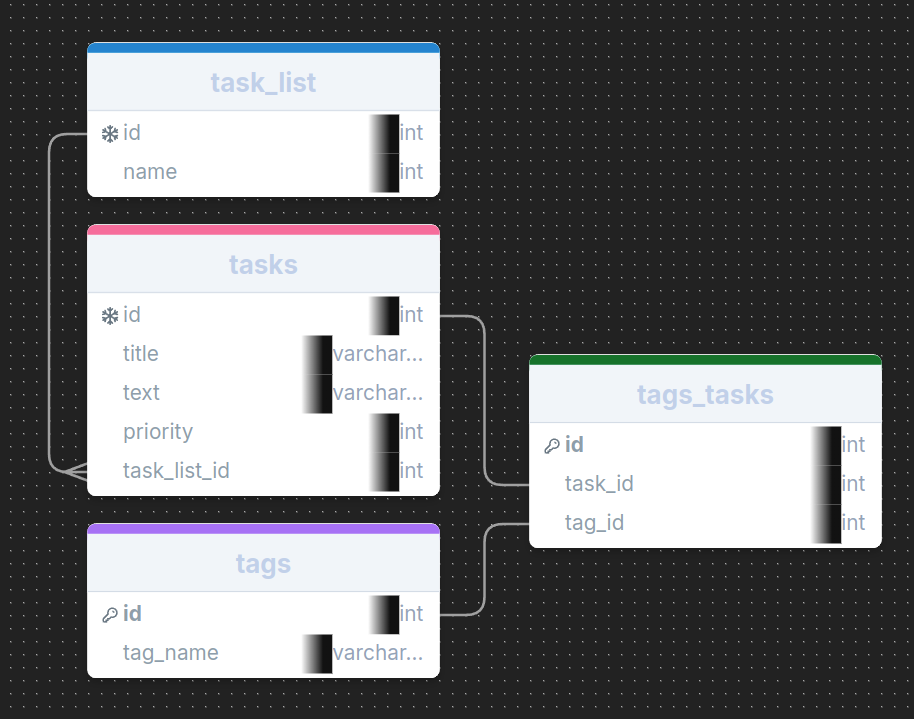
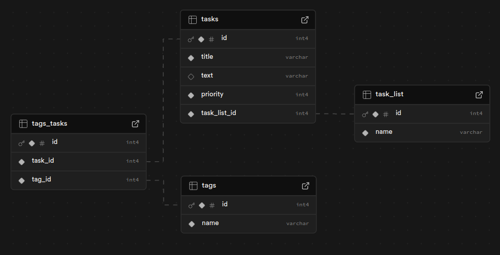

# Week 7 Assignment

A task management application, with a 'Task List' that holds a list of container categories each able to hold a list of tasks.

tasks have a title, description, priority and none or more tags

tags: each task can have none or more tags, tags can be added and removed with the tag editor (stretch goal)
There are three default tags 'Progressing','Completed' and 'On Hold'

First job will be to design the tables and create the mono repository.

##### Checkpoint 1

I have my tables designed using drawsql.com:

The _task_list_ table holds the category titles, each task will link via a foreign key to a category in the task_list.

The _tasks_ table hold the core tasks, including title, text, priority and task_list_id.

The _tags_ table hold the names of all the tags, I'd like to add image icons as a stretch goal.

The _tags_tasks_ table is a junction table holding the connections between tags and tasks.

This commit includes the basic client/server framework ready for expansion, from here I plan to create the SQL queries using the exported data from drawsql.com and run them on the supabase, then commit the SQLQueries.sql for your reference.

###### Checkpoint 2

Database queries to create the four tables have been made and run on supabase, the queries.sql can be found in the reporoot/misc folder, below is the schema as seen on supabase.com

