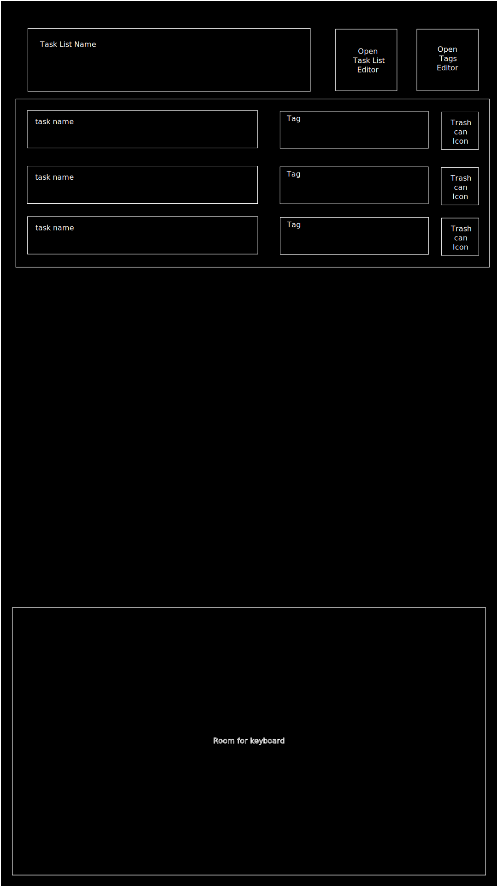

# Week 7 Assignment

A task management application, with a 'Task List' that holds a list of container categories each able to hold a list of tasks.

tasks have a title, description, priority and none or more tags

tags: each task can have none or more tags, tags can be added and removed with the tag editor (stretch goal)
There are three default tags 'Progressing','Completed' and 'On Hold'

First job will be to design the tables and create the mono repository.

---

##### Checkpoint 1

I have my tables designed using drawsql.com:

The _task_list_ table holds the category titles, each task will link via a foreign key to a category in the task_list.

The _tasks_ table hold the core tasks, including title, text, priority and task_list_id.

The _tags_ table hold the names of all the tags, I'd like to add image icons as a stretch goal.

The _tags_tasks_ table is a junction table holding the connections between tags and tasks.

This commit includes the basic client/server framework ready for expansion, from here I plan to create the SQL queries using the exported data from drawsql.com and run them on the supabase, then commit the SQLQueries.sql for your reference.

---

=======

###### Checkpoint 2

Database queries to create the four tables have been made and run on supabase, the queries.sql can be found in the reporoot/misc folder, below is the schema as seen on supabase.com

---

##### Checkpoint 3

Wireframes completed, the App has been designed for mobile devices used in vertical orientation, personal stretch goals of landscape and desktop styling.

I have four conditionally rendered pages;

###### main page

###### task editing page

###### tag selecting and editing page

###### task list editing page

This page has the same layout as the tag editing page

This turned into a bit of a rabbit hole and I have limited the design to the basics, This may still be a design too far, I'll start with a single fixed task list and add in the functionality for adding/editing and deleting lists later if time, same for the tags, for now I'll have a fixed set of tags and add the editing later if time.

My Key focus now is the main page and task view/editing page, I'll use place holders for the other two pages.

Next checkpoint will be the basic framework client where I am able to navigate the whole app.

---

##### Checkpoint 4

This took way longer than it should, I had completely forgotten the workshop on SPA, but eventually I arrived where I need to be, I now have a basic client with navigation, next up I will create the database reset and test data seed files.

---

#### Checkpoint 5

I discovered that creating or rather truncating database tables that have foreign key constraints should not be done in separate SQL instructions, I kept getting errors while debugging my seed files, so I switched to pure SQL using the editor on supabase.com and got both queries working, two files, one to create the default tables with default entries and the other to create the tables and more extensive test entries, named defaultDataBase.sql and testData.sql respectively, they can be found in the misc directory in the repo root. During my attempt at the js seed files I added the following to package.json

    "resetDB": "node resetDatabase",
    "testDB": "node installTestData"

I will return to the seed files after I have the assignment objectives completed.

Next I want to get the server up and running.

---

#### Checkpoint 6

Created server and a route names /init to return a list of 'task list names' and the full set of tasks, remembering to stick with the assignment objectives. (I have the full app in my mind churning over how to include everything needed!)

---

#### Checkpoint 7

Created component to display the tasks this uses .map (TaskList.jsx)
Created additional database test data - testData2.sql, more orientated towards actual tasks.
Added interval timer to the TaskList Component and checked that it updates when I add a row using subabase SQL editor - this is working.

---
